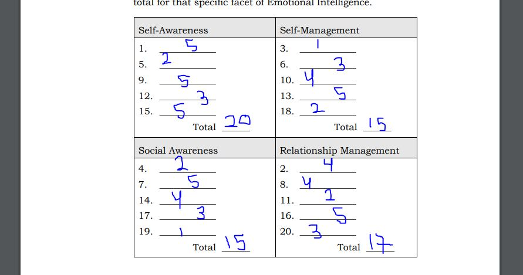
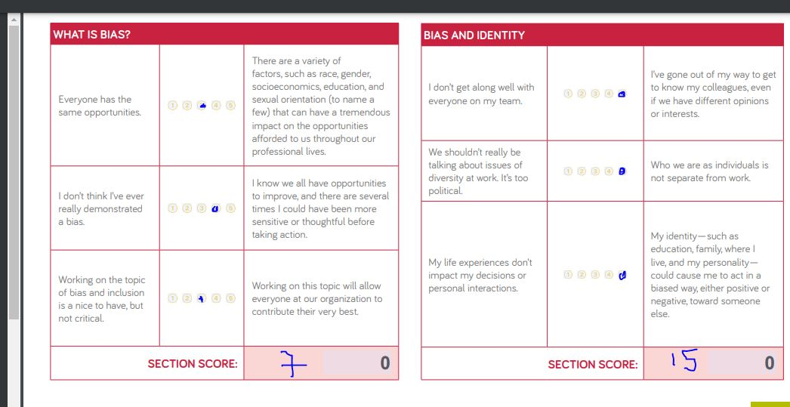
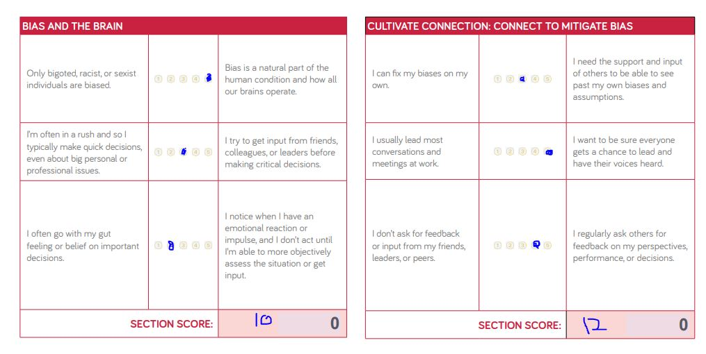
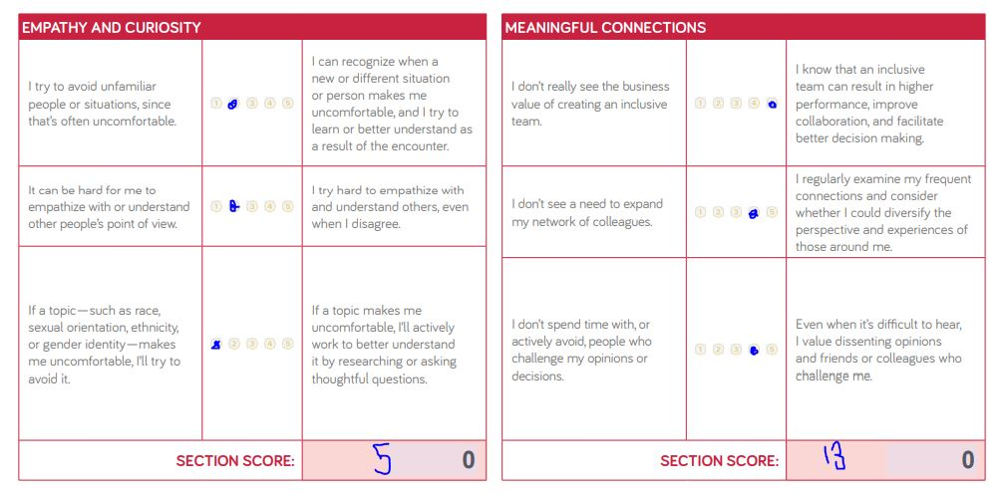
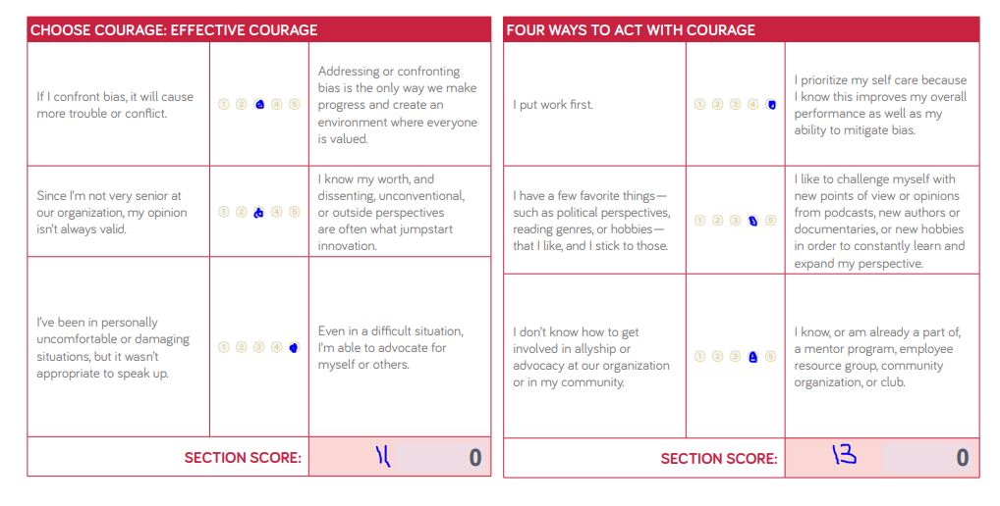
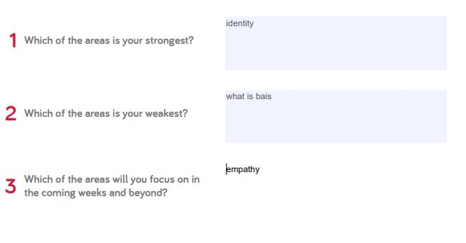

# **Reading notes**

## Growth-Mindset 

The growth mindset is about knowing the strengths of and my skills which will serve while coding and doing tasks it's also about knowing which skills that represent weaknesses and how to improve them and get over them.

