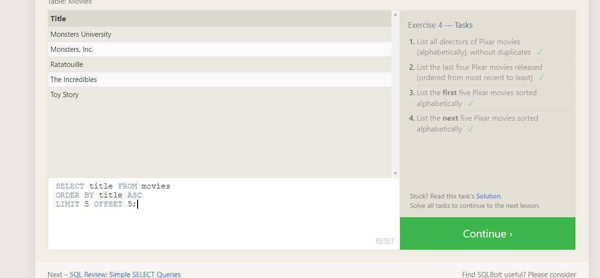

# **Reading Notes**

This website helps keeping track of : 

1. Observations 
2. Questions 
 
 from **Reading assigments** 
 
 `https://canvas.instructure.com/courses/7267075/discussion_topics/18851206?module_item_id=89152329`

## - Code 102 - Intro to Software Development
## - Code 201 - Foundations of Software Development
## - Code 301 - Intermediate Software Development
## - Code 401 - Advanced Software Development 

| Header       | Description                                                                                                        |
|--------------|--------------------------------------------------------------------------------------------------------------------|
| SQL Part     | SQL has many commands that control databases and perform various operations, such as adding and dropping columns. It also includes keywords like `WHERE`, `BETWEEN`, `ORDER BY`, and `GROUP BY` for data filtering and manipulation. SQL is essential for efficient database management. |
G)