# Reading notes 

## **Introduction to SQL**

 SQL has many commands that control databases and perform various operations, such as adding and dropping columns. It also includes keywords like `WHERE`, `BETWEEN`, `ORDER BY`, and `GROUP BY` for data filtering and manipulation. SQL is essential for efficient database management.

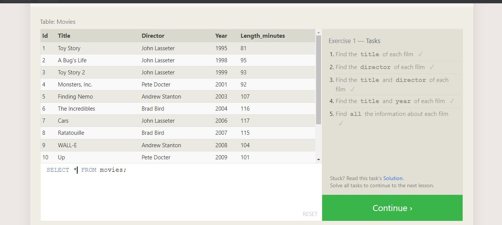    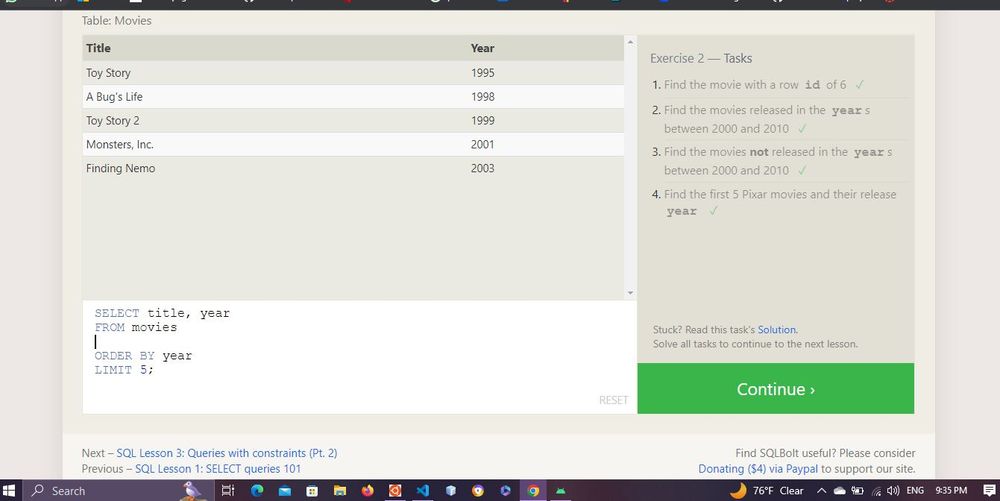  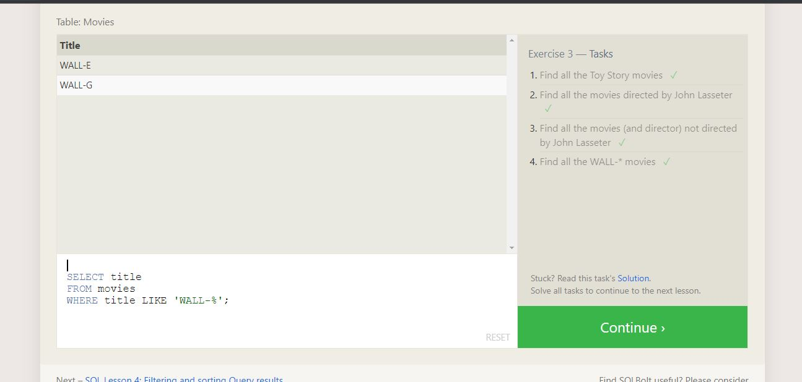    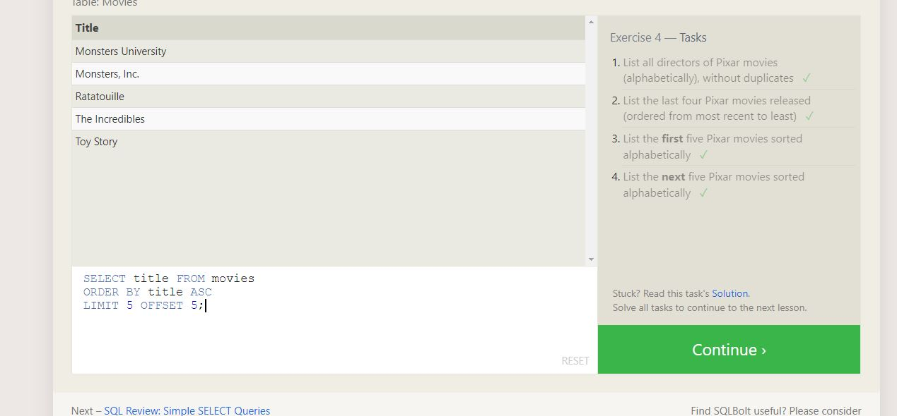 

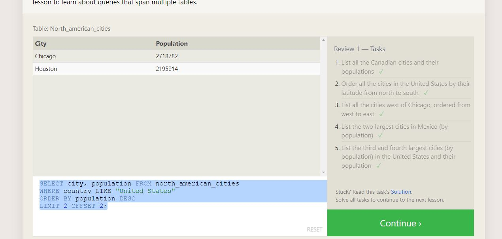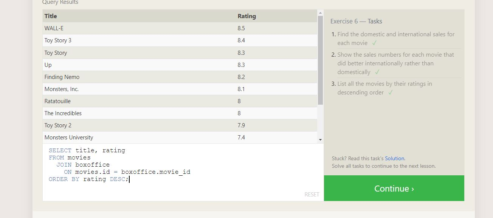   

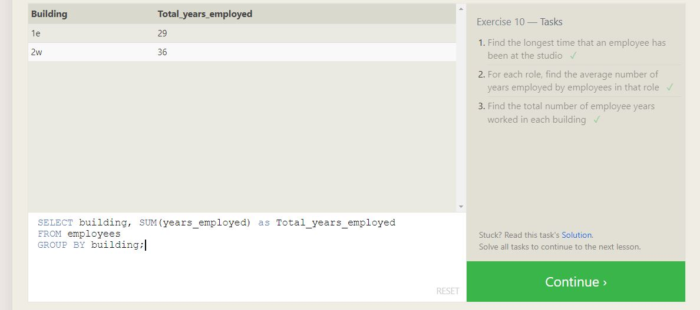   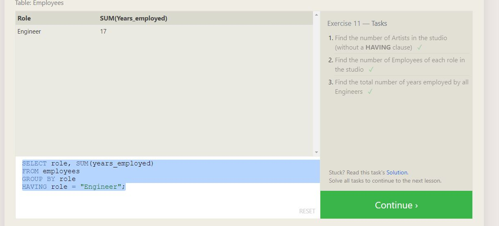      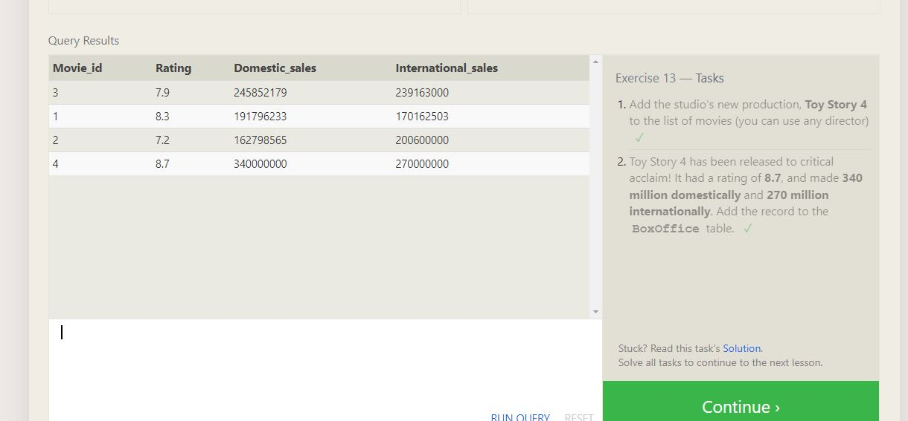    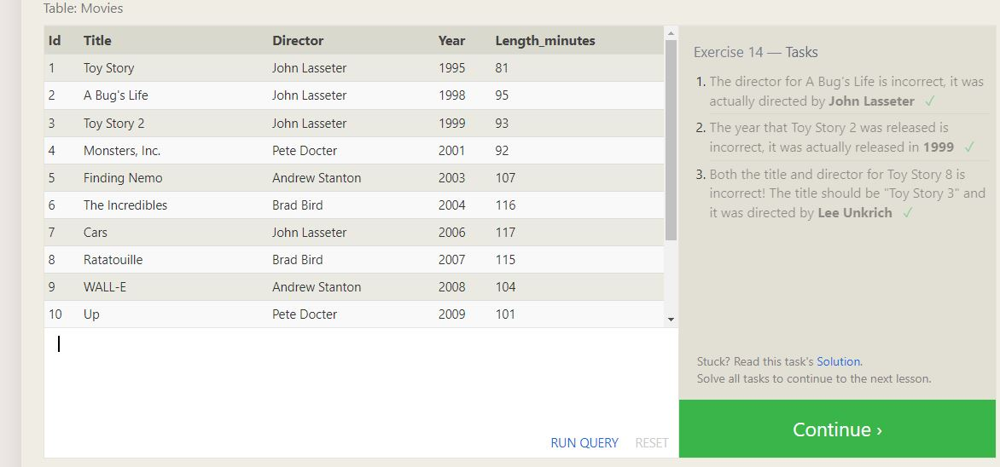

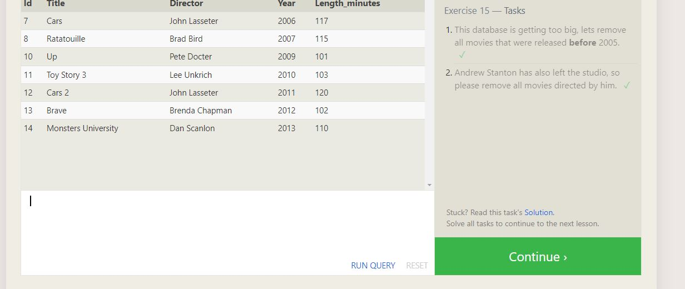     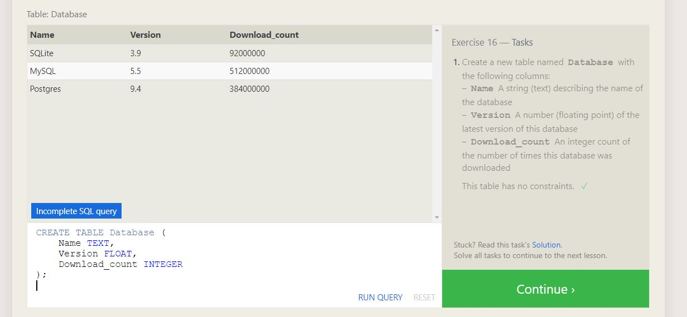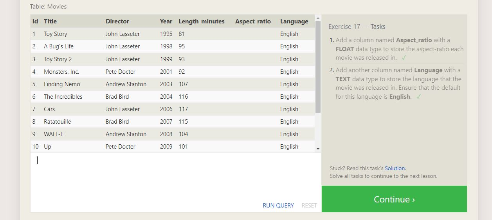   
 